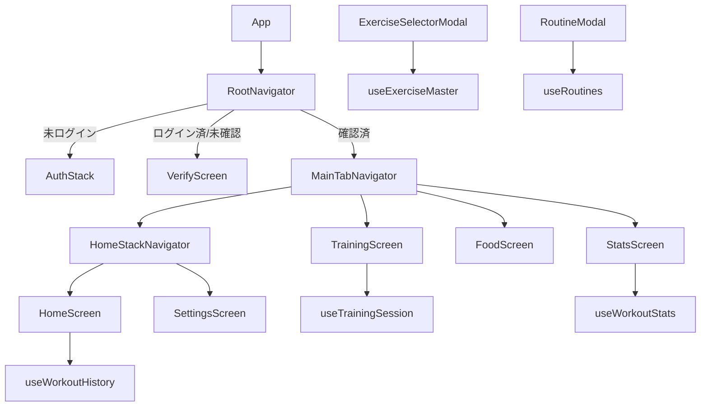

### 目的と現状整理

- **現状の App.js の役割**
  - 認証状態の監視 (`onAuthStateChanged`)、メール確認 (`VerificationScreen`)、ログイン画面 (`LoginScreen`) をすべて内包
  - ホーム画面 (`HomeScreen`) 内で Firestore から履歴取得・トレーニング日一覧・AsyncStorage へのキャッシュを実行
  - トレーニング画面 (`TrainingScreen`) でメニュー編集、タイマー、ルーティン保存/読込、ワークアウト保存などのロジックと UI が密結合
  - 統計画面 (`StatsScreen`) でローカルキャッシュから統計値を計算しつつ、グラフを描画
  - 各種モーダル (`ExerciseSelectorModal`, `RoutineModal`, `WorkoutDetailModal`) やカレンダー UI (`CalendarSection`) も全て同一ファイル内
  - さらに、タブ/スタック ナビゲーション定義も App.js に含まれている
- **目標**
  - App.js は「アプリのエントリーポイント + ルートナビゲーションの呼び出し」だけにし、画面は `screens/`、UI 部品は `components/`、状態/データ取得は `hooks/`、共通処理は `utils/` に分割する。
  - 既に `screens/` や `components/home/CalendarSection.tsx` などのファイルが存在するので、**重複実装を避けつつそれらに集約**していく。
  - 見た目・挙動は一切変えず、責務の場所だけを変える。

### 新しいフォルダ構成案（ツリー構造）

> すでに存在するファイル/フォルダは流用し、なければこの構成に合わせて追加します。

```text
App.js                             # 最小限のエントリーポイント（後述）

navigation/
  RootNavigator.tsx                # 認証状態に応じて AuthStack / Verify / MainTabs を出し分け
  MainTabNavigator.tsx             # Home / Training / Food / Stats のタブ構成
  HomeStackNavigator.tsx           # HomeScreen と SettingsScreen のスタック

screens/
  auth/
    LoginScreen.tsx               # 既存 or App.js 内 LoginScreen を移動
    VerificationScreen.tsx        # 既存 or App.js 内 VerificationScreen を移動
  home/
    HomeScreen.tsx                # ホーム画面のコンテナ（データ取得は hook に委譲）
  training/
    TrainingScreen.tsx            # トレーニング画面のコンテナ
  stats/
    StatsScreen.tsx               # 統計画面のコンテナ
  food/
    FoodScreen.tsx                # 現在の DummyScreen("準備中") を独立画面に
  settings/
    SettingsScreen.tsx            # 設定画面（アカウント削除・ログアウト）

components/
  home/
    CalendarSection.tsx           # 既存ファイルと App.js 内実装を統合
    WorkoutDetailModal.tsx        # 既存ファイルと App.js 内実装を統合
    HomeHeader.tsx                # Welcome ラベル＋設定アイコン部分
    LatestWorkoutCard.tsx         # LATEST WORKOUT カード（ルーティン名と日付、種目リスト）
  training/
    ExerciseSelectorModal.tsx     # 種目選択モーダル（カテゴリー/セクションリスト UI）
    RoutineModal.tsx              # ルーティン保存・読込モーダル
    ExerciseCard.tsx              # 1 種目分のセット入力・DONE トグル・削除ボタンなど
    TrainingHeader.tsx            # "Today's Workout" + ルーティン名 + タイマー表示
    EmptyTrainingState.tsx        # 種目が 0 件のときのダンベルアイコンとメッセージ
  common/
    PrimaryButton.tsx (任意)      # ボタンスタイルをまとめたい場合はここに（初期はなくても可）

hooks/
  useAuthState.ts                 # 既存ファイルを拡張: user / initializing / forceRefreshUser をカプセル化
  useWorkoutHistory.ts            # HomeScreen 用: Firestore から履歴取得 + trainedDays 計算 + AsyncStorage への保存
  useTrainingSession.ts           # TrainingScreen 用: menu, currentRoutineName, timer, 各種ハンドラ（追加/削除/更新/保存）
  useExerciseMaster.ts            # ExerciseSelectorModal 用: master_data からカテゴリ/セクションデータを取得・整形
  useRoutines.ts                  # RoutineModal 用: ルーティン一覧取得・保存・削除
  useWorkoutStats.ts              # StatsScreen 用: AsyncStorage の履歴から weeklyData / bodyPartData を算出

utils/
  time.ts                         # formatTime(totalSeconds) のような時間フォーマット関数
  workoutCategories.ts            # Stats 用の「種目名 → 部位カテゴリ」判定ロジックを切り出し
```

### 各コンポーネント / フックの責務設計

- **App.js**
  - `NavigationContainer` と `RootNavigator` を呼び出すだけに簡略化。
  - 認証状態 (`user`, `initializing`, `forceRefreshUser`) は `useAuthState` フックに完全移譲。
- **navigation/RootNavigator.tsx**
  - `useAuthState` を利用して、
    - 未ログイン → `AuthStack` (LoginScreen)
    - ログイン済だが `emailVerified` false → `VerificationScreen`
    - メール確認済み → `MainTabNavigator`
  - 現在 App.js の最後にある Stack 設定 (`Login`, `Verify`, `Main`) をそのまま移し替え。
- **navigation/MainTabNavigator.tsx**
  - 現在の `MainTabNavigator` 部分を移動。
  - HomeTab → `HomeStackNavigator`、TrainingTab → `TrainingScreen`、FoodTab → `FoodScreen`、StatsTab → `StatsScreen` を使用。
  - タブのアイコン/スタイル (`tabBarStyle`, `tabBarActiveTintColor` など) はそのまま維持。
- **navigation/HomeStackNavigator.tsx**
  - App.js 内 `HomeStackNavigator` を移し、`HomeScreen` / `SettingsScreen` を画面コンポーネントとして利用。
- **screens/auth/LoginScreen.tsx**
  - App.js 内の `LoginScreen` 実装を丸ごと移動。
  - メールアドレス/パスワードの状態、利用規約チェック、`handleAuthAction`（ログイン/新規登録）などのロジックもここに保持（初期段階では hook には切り出さず、画面単位で完結）。
- **screens/auth/VerificationScreen.tsx**
  - App.js 内 `VerificationScreen` を移動。
  - `onCheckVerified` コールバックは props として `RootNavigator` から受け取る形を維持。
- **screens/settings/SettingsScreen.tsx**
  - App.js 内 `SettingsScreen` を移動し、
    - ログアウト確認 (`handleSignOut`)
    - アカウント削除確認 (`handleDeleteAccount` + `deleteUser`)
    - ヘッダー UI
      を保持。
- **screens/home/HomeScreen.tsx**
  - 画面の構成のみを担当。
  - データ取得や削除ロジックは `hooks/useWorkoutHistory.ts` に委譲し、
    - `history`
    - `trainedDays`
    - `lastWorkout`
    - `selectedWorkout` / `modalVisible` / `handleDayPress` / `handleDeleteWorkout`
      などを hook から受け取るイメージ。
  - UI 組み立てでは `HomeHeader`, `CalendarSection`, `LatestWorkoutCard`, `WorkoutDetailModal` を使用し、App.js にある JSX を分割して組み直す。
- **components/home/CalendarSection.tsx & WorkoutDetailModal.tsx**
  - 既に存在するファイルがあるため、App.js 内実装と比較し、足りない props やスタイルを足して「単一の真実のソース」に統合。
  - HomeScreen からは props を渡すだけにする。
- **screens/training/TrainingScreen.tsx**
  - 画面レイアウトとモーダルの開閉状態 (`modalVisible`, `routineModalVisible`) のみ保持。
  - メニュー状態やタイマー等のロジックを `useTrainingSession` から受け取る：
    - `menu`, `currentRoutineName`, `timerSeconds`, `isTimerActive`
    - `handleAddExercise`, `handleRemoveExercise`, `handleAddSet`, `handleRemoveSet`, `handleUpdateSet`, `toggleSetDone`, `handleFinishWorkout` など
  - UI は `TrainingHeader`, `ExerciseCard`, `EmptyTrainingState`, `ExerciseSelectorModal`, `RoutineModal` コンポーネントを組み合わせて構築。
- **components/training/ コンポーネント**
  - `TrainingHeader.tsx`: タイトル・ルーティン名・タイマー表示の UI。
  - `ExerciseCard.tsx`: 1 種目分のセット入力行 + DONE ボタン + セット追加/削除ボタン。
  - `EmptyTrainingState.tsx`: 種目 0 件時のアイコンとメッセージ。
  - `ExerciseSelectorModal.tsx`: 現在の JSX をそのまま移しつつ、データ取得は `useExerciseMaster` から供給。
  - `RoutineModal.tsx`: ルーティン一覧/保存 UI を保持し、Firestore 処理は `useRoutines` に移譲。
- **screens/stats/StatsScreen.tsx**
  - グラフの描画部分に専念。
  - データ計算部分（AsyncStorage 読み込み、weeklyData/bodyPartData 計算）は `useWorkoutStats` から受け取るだけにする。
- **hooks/useWorkoutHistory.ts**
  - HomeScreen 内の `fetchHistory`, `useFocusEffect` 周りを集約。
  - `history`, `trainedDays`, `lastWorkout`, `selectedWorkout` などを state として持ち、
    - Firestore からの履歴取得
    - トレーニング日配列の生成
    - AsyncStorage への `@workout_history` 保存
    - 指定日のワークアウト選択 (`handleDayPress` 相当)
    - 記録削除 (`handleDeleteWorkout` 相当)
      を行う。
- **hooks/useTrainingSession.ts**
  - TrainingScreen のビジネスロジックを集約：
    - メニュー (`menu`) の追加/削除/更新ロジック
    - ルーティン読み込み (`handleLoadRoutine`) とルーティン名の管理
    - タイマー (`timerSeconds`, `isTimerActive`) の進行・リセットロジック
    - Firestore へのワークアウト保存 (`handleFinishWorkout` 内側)
    - タブバー表示/非表示制御は、Navigation の仕様に合わせて `navigation` を引数 or コールバックで扱う
- **hooks/useExerciseMaster.ts**
  - `ExerciseSelectorModal` 内の `useEffect` で行っている master_data 取得と `sections` 化ロジックを担当。
  - API 変更時もここだけ直せばよいようにする。
- **hooks/useRoutines.ts**
  - `fetchRoutines`, `handleSaveRoutine`, `handleDeleteRoutine` など Firestore ルーティン管理を集約。
- **hooks/useWorkoutStats.ts**
  - AsyncStorage から `@workout_history` を読み込み、
    - 直近 4 週間のワークアウト回数配列
    - 今月の部位別セット数配列
      を計算して返す。
  - 種目名→部位の判定ロジックは `utils/workoutCategories.ts` に切り出して利用。
- **utils/time.ts & utils/workoutCategories.ts**
  - `time.ts`: `formatTime(totalSeconds)` を移動し、他の画面でも再利用可能に。
  - `workoutCategories.ts`: Stats の `if (name.includes('ベンチ') ...)` 連鎖を関数化し、テストしやすくする。

### 簡易アーキテクチャ図（ナビゲーションと状態の流れ）



### 実際のリファクタリング手順（段階的）

1. **ナビゲーションの分離**

- `navigation/RootNavigator.tsx`, `navigation/MainTabNavigator.tsx`, `navigation/HomeStackNavigator.tsx` を作成し、App.js のナビゲーション関連コードを移動。
- `App.js` は `NavigationContainer` + `RootNavigator` を返すだけの構造にする準備を行う。

1. **認証系画面の分離**

- `screens/auth/LoginScreen.tsx`, `screens/auth/VerificationScreen.tsx` に対応するコンポーネントを移動/統合。
- `hooks/useAuthState.ts` を整備し、App.js から認証状態監視を切り離す。

1. **ホーム画面・関連 UI の分離**

- `screens/home/HomeScreen.tsx` を新設し、App.js 内 HomeScreen を移動。
- `components/home/CalendarSection.tsx`, `components/home/WorkoutDetailModal.tsx`, `HomeHeader.tsx`, `LatestWorkoutCard.tsx` に UI を分解。
- `hooks/useWorkoutHistory.ts` を導入し、Firestore/AsyncStorage ロジックを移し替える。

1. **トレーニング画面・モーダルの分離**

- `screens/training/TrainingScreen.tsx` を作成し、App.js から JSX を移動。
- `components/training/ExerciseSelectorModal.tsx`, `RoutineModal.tsx`, `ExerciseCard.tsx`, `TrainingHeader.tsx`, `EmptyTrainingState.tsx` に UI を切り出し。
- `hooks/useTrainingSession.ts`, `hooks/useExerciseMaster.ts`, `hooks/useRoutines.ts` を順次導入し、ビジネスロジック/Firestore 呼び出しを画面から分離。

1. **統計画面の分離**

- `screens/stats/StatsScreen.tsx` を用意し、App.js 内の StatsScreen を移動。
- `hooks/useWorkoutStats.ts` と `utils/workoutCategories.ts` を導入し、統計計算ロジックを画面から切り離す。

1. **ダミー画面・設定画面の整理**

- `screens/food/FoodScreen.tsx` と `screens/settings/SettingsScreen.tsx` を整備し、`DummyScreen` や inline `SettingsScreen` を統合。

1. **App.js の最終整理**

- すべての画面/モーダル/ロジックが外出しされたのを確認したら、App.js から不要コードを削除。
- 最終的な App.js は、`useAuthState` を使うか、もしくは `RootNavigator` 内に閉じ込める形で "エントリーポイントのみ" のシンプルな構造にする。

この設計案に同意いただければ、この段階構成に沿って、既存の `screens/`, `components/`, `navigation/` ファイルを活かしながら、実際のコード分割作業に進みます。

