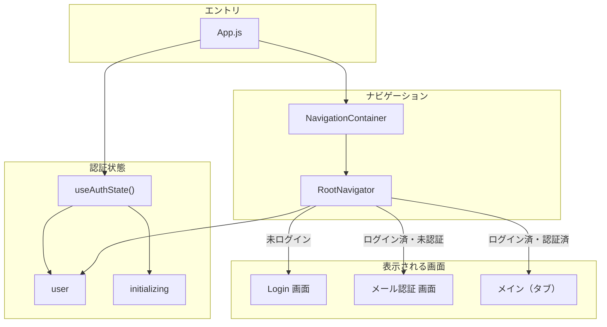
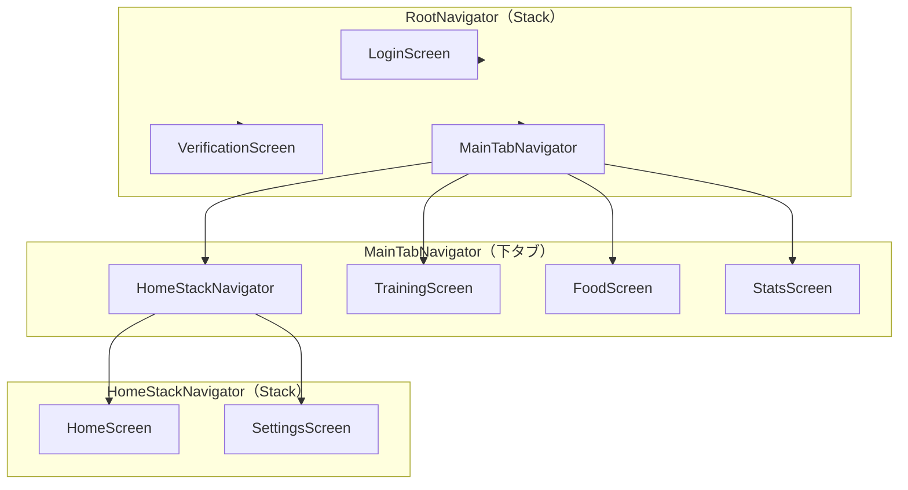
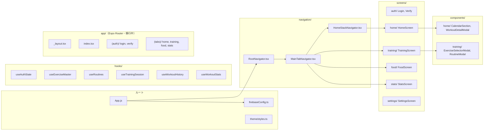
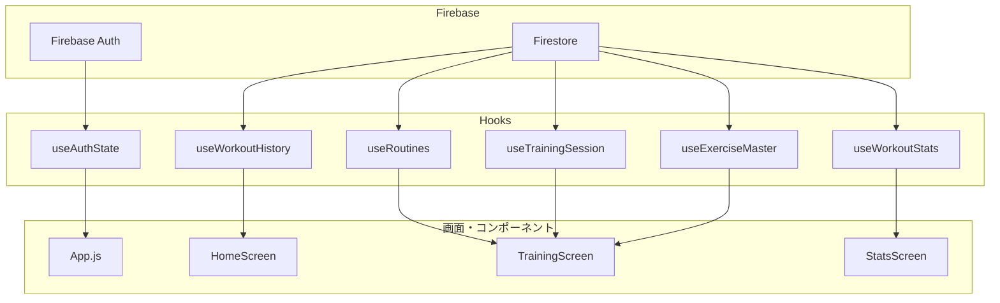
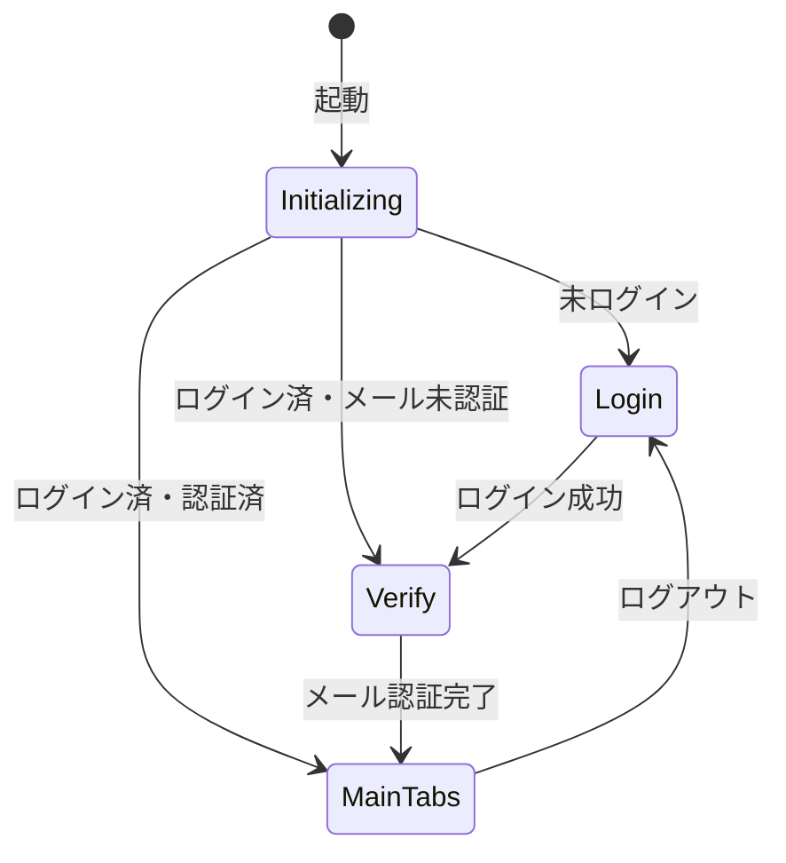
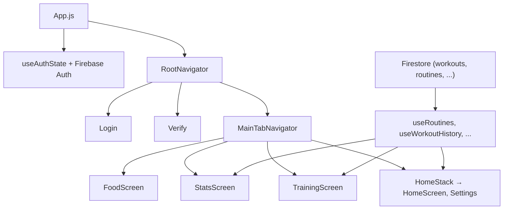

# Notefit AI アーキテクチャ図

全体像を把握しやすいように、Mermaid 図で整理しています。  
Cursor / VSCode の Markdown プレビューや GitHub でそのまま表示できます。

---

## 1. アプリの起動〜画面表示の流れ

- **App.js** がエントリで、**useAuthState** で Firebase のログイン状態を監視。
- **initializing** 中はローディング、終了後に **RootNavigator** で「ログイン / 認証 / メイン」のどれかを表示。

---

## 2. 画面・ナビゲーション構造

| タブ | 画面 | 役割 |
|------|------|------|
| Home | HomeScreen → Settings | カレンダー・直近ワークアウト・設定 |
| Training | TrainingScreen | トレーニング記録・ルーティン |
| Food | FoodScreen | 食事（画面のみ） |
| Stats | StatsScreen | 統計 |

---

## 3. フォルダ・ファイル構成（主要部分）

- **実際のエントリ**は **App.js**。**navigation/** と **screens/** がメインの画面ツリー。
- **app/** は Expo Router 用で、「Expo Router migration in progress」のため、現状は **App.js + React Navigation** が主役。

---

## 4. データの流れ（Firebase・Hooks）

- **認証**: `useAuthState` → Firebase Auth。
- **トレーニング**: マスタ・ルーティン・セッション・履歴は Firestore + 各 hooks。
- **統計**: `useWorkoutStats` を Stats 画面で利用。

---

## 5. 認証フロー（誰がどこに飛ぶか）

- **app/_layout.tsx**（Expo Router）側でも同様の分岐を `useEffect` で行っているが、**実際に画面を出しているのは App.js の RootNavigator**。

---

## 6. まとめ（一枚で見る）

- **入口**: App.js → useAuthState → RootNavigator。
- **画面**: Login / Verify / メイン（Home, Training, Food, Stats）。
- **データ**: Firestore + hooks が各画面に渡る。

編集や追記が必要なら、この `docs/architecture-diagram.md` を直接いじると全体図を更新しやすいです。
